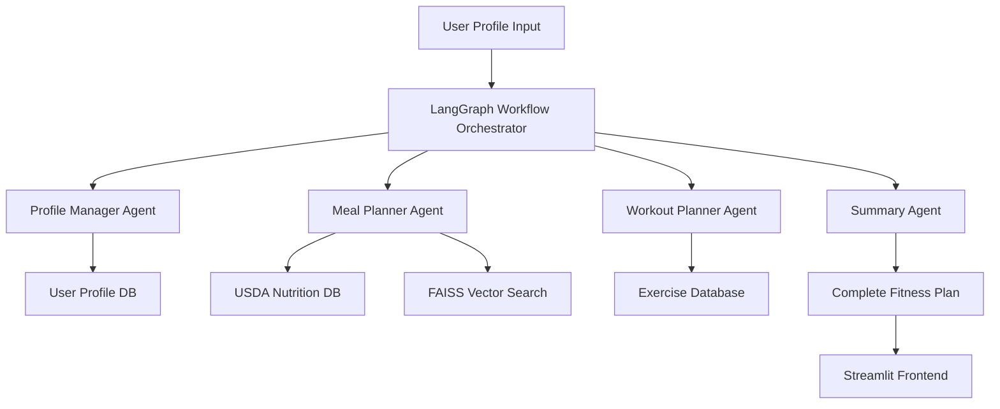

# AI Fitness Planner: LangGraph & LLM Architecture Report

## Overview

The AI Fitness Planner leverages **LangGraph**, **LangChain**, and **Large Language Models (LLMs)** to create a sophisticated multi-agent system that generates personalized fitness and nutrition plans. This document provides a comprehensive overview of how these technologies work together to deliver intelligent, adaptive fitness recommendations.

## Table of Contents

1. [Architecture Overview](#architecture-overview)
2. [LangGraph Implementation](#langgraph-implementation)
3. [Agent System Design](#agent-system-design)
4. [LLM Integration](#llm-integration)
5. [Data Flow & Orchestration](#data-flow--orchestration)
6. [Vector Search & RAG](#vector-search--rag)
7. [API Endpoints](#api-endpoints)
8. [Use Cases & Examples](#use-cases--examples)
9. [Benefits of LangGraph Approach](#benefits-of-langgraph-approach)
10. [LangSmith Observability Integration](#langsmith-observability-integration)
11. [Future Enhancements](#future-enhancements)

---

## Architecture Overview

### High-Level System Design



### Technology Stack

- **LangGraph**: Workflow orchestration and agent coordination
- **LangChain**: LLM integration and tool management
- **GPT-4**: Primary language model for reasoning and generation
- **FAISS**: Vector similarity search for nutrition data
- **MongoDB**: USDA nutrition database (300k+ foods)
- **PostgreSQL**: User profiles and plan storage
- **FastAPI**: Backend API services
- **Streamlit**: Interactive frontend

---

## LangGraph Implementation

### What is LangGraph?

LangGraph is a library for building stateful, multi-actor applications with LLMs. It extends LangChain's expression language with the ability to coordinate multiple actors across multiple steps of computation in a cyclic manner.

### Key Features Used

1. **State Management**: Maintains user context across agent interactions
2. **Workflow Orchestration**: Coordinates multiple agents in sequence
3. **Conditional Logic**: Routes decisions based on user preferences
4. **Memory Persistence**: Stores and retrieves user profile data
5. **Error Handling**: Graceful failure recovery and retry mechanisms

### LangGraph Workflow Structure

```python
# Simplified workflow definition
class FitnessWorkflowState(TypedDict):
    user_id: str
    profile: dict
    meal_plan: dict
    workout_plan: dict
    summary: str
    errors: list

def create_fitness_workflow():
    workflow = StateGraph(FitnessWorkflowState)
    
    # Add nodes
    workflow.add_node("profile_manager", profile_manager_agent)
    workflow.add_node("meal_planner", meal_planner_agent)
    workflow.add_node("workout_planner", workout_planner_agent)
    workflow.add_node("summarizer", summary_agent)
    
    # Define flow
    workflow.add_edge(START, "profile_manager")
    workflow.add_edge("profile_manager", "meal_planner")
    workflow.add_edge("profile_manager", "workout_planner")
    workflow.add_edge(["meal_planner", "workout_planner"], "summarizer")
    workflow.add_edge("summarizer", END)
    
    return workflow.compile()
```

---

## Agent System Design

### 1. Profile Manager Agent

**Purpose**: Analyzes user data and calculates nutritional requirements

**LLM Tasks**:
- Interpret user goals (cut, bulk, maintenance, recomp)
- Calculate BMR using Mifflin-St Jeor equation
- Adjust calories based on activity level and goals
- Determine optimal macro ratios

**Key Features**:
```python
def profile_manager_agent(state: FitnessWorkflowState):
    """
    Processes user profile and calculates targets
    - BMR calculation
    - TDEE adjustment
    - Macro distribution
    - Goal-specific modifications
    """
    profile = state["profile"]
    
    # LLM reasoning for goal interpretation
    goal_analysis = llm.invoke([
        ("system", "You are a fitness expert. Analyze this user's goals..."),
        ("human", f"User profile: {profile}")
    ])
    
    # Calculate nutritional targets
    targets = calculate_nutrition_targets(profile, goal_analysis)
    
    return {"profile": {**profile, **targets}}
```

### 2. Meal Planner Agent

**Purpose**: Creates personalized meal plans using USDA nutrition database

**LLM Tasks**:
- Understand dietary preferences and restrictions
- Generate meal ideas based on macro targets
- Search and select appropriate foods from database
- Create balanced daily meal plans

**Vector Search Integration**:
```python
def meal_planner_agent(state: FitnessWorkflowState):
    """
    Generates meal plans using semantic food search
    - Semantic food matching with FAISS
    - Macro optimization
    - Preference accommodation
    """
    profile = state["profile"]
    
    # LLM generates meal concepts
    meal_concepts = llm.invoke([
        ("system", "Create meal ideas for this user's goals..."),
        ("human", f"Profile: {profile}, Macros: {profile['targets']}")
    ])
    
    # Vector search for specific foods
    foods = []
    for concept in meal_concepts:
        search_results = vector_search.similarity_search(
            concept, 
            filter={"allergens": {"$nin": profile["allergies"]}}
        )
        foods.extend(search_results)
    
    # LLM creates structured meal plan
    meal_plan = llm.invoke([
        ("system", "Create a structured meal plan..."),
        ("human", f"Available foods: {foods}, Targets: {profile['targets']}")
    ])
    
    return {"meal_plan": meal_plan}
```

### 3. Workout Planner Agent

**Purpose**: Designs training programs based on user goals and equipment

**LLM Tasks**:
- Analyze fitness goals and experience level
- Select appropriate training split and style
- Generate exercise selections and progressions
- Create weekly workout schedules

**Key Features**:
```python
def workout_planner_agent(state: FitnessWorkflowState):
    """
    Creates personalized workout programs
    - Goal-specific programming
    - Equipment-based exercise selection
    - Progressive overload planning
    """
    profile = state["profile"]
    
    # LLM analyzes training requirements
    training_analysis = llm.invoke([
        ("system", "You are a certified personal trainer..."),
        ("human", f"Design a workout for: {profile}")
    ])
    
    # Generate structured workout plan
    workout_plan = create_workout_structure(training_analysis, profile)
    
    return {"workout_plan": workout_plan}
```

### 4. Summary Agent

**Purpose**: Combines all plans into cohesive, actionable guidance

**LLM Tasks**:
- Synthesize meal and workout plans
- Generate implementation guidance
- Create motivational messaging
- Provide troubleshooting tips

---

## LLM Integration

### Model Selection

**Primary Model**: GPT-4
- Superior reasoning capabilities
- Better understanding of complex nutritional concepts
- Improved instruction following for structured outputs

**Alternative Models**: GPT-3.5-turbo for simpler tasks
- Cost optimization for basic operations
- Faster response times for simple queries

### Prompt Engineering Strategies

#### 1. System Prompts with Domain Expertise
```python
NUTRITION_EXPERT_PROMPT = """
You are a certified nutritionist and fitness expert with 10+ years of experience.
Your expertise includes:
- Macro and micronutrient planning
- Sports nutrition and performance optimization
- Dietary restriction accommodation
- Meal timing and frequency optimization

Always provide evidence-based recommendations and consider individual needs.
"""
```

#### 2. Few-Shot Learning Examples
```python
MEAL_PLANNING_EXAMPLES = """
Example 1:
User: 25-year-old male, 180cm, 80kg, goal: lean bulk, active lifestyle
Output: 2800 calories, 140g protein, 350g carbs, 93g fat
Meal 1: Oatmeal with berries and whey protein (520 cal)
...

Example 2:
User: 30-year-old female, 165cm, 65kg, goal: fat loss, vegetarian
Output: 1600 calories, 120g protein, 160g carbs, 53g fat
...
"""
```

#### 3. Structured Output Format
```python
OUTPUT_SCHEMA = {
    "meal_plan": {
        "daily_targets": {"calories": int, "protein_g": int, "carbs_g": int, "fat_g": int},
        "meals": [
            {
                "name": str,
                "time": str,
                "foods": [{"name": str, "amount": str, "calories": int}],
                "macros": {"protein": int, "carbs": int, "fat": int}
            }
        ]
    }
}
```

---

## Data Flow & Orchestration

### Workflow Execution Steps

1. **Initialization**
   ```python
   # User submits profile through Streamlit
   POST /v1/langgraph/generate-fitness-plan/
   {
       "user_id": "user_123",
       "generate_meal_plan": true,
       "generate_workout_plan": true,
       "days": 7,
       "meal_preferences": {"days": 7, "meal_count": 3},
       "workout_preferences": {"days_per_week": 4}
   }
   ```

2. **Profile Processing**
   - LangGraph invokes Profile Manager Agent
   - Agent calculates BMR, TDEE, and macro targets
   - Results stored in workflow state

3. **Parallel Plan Generation**
   - Meal Planner and Workout Planner agents run in parallel
   - Each agent has access to profile data from state
   - Vector search and database queries executed

4. **Plan Synthesis**
   - Summary Agent combines all outputs
   - Generates coherent implementation guidance
   - Creates motivational content

5. **Response Delivery**
   ```json
   {
       "summary": "Your personalized 7-day plan...",
       "meal_plan": {...},
       "workout_plan": {...},
       "execution_steps": ["Profile analyzed", "Meal plan created", ...],
       "generated_at": "2024-01-15T10:30:00Z"
   }
   ```

### State Management

LangGraph maintains state throughout the workflow:

```python
class WorkflowState:
    user_profile: Dict
    nutrition_targets: Dict
    meal_plan: Dict
    workout_plan: Dict
    execution_log: List[str]
    errors: List[str]
```

---

## Vector Search & RAG

### USDA Nutrition Database

**Data Size**: 3.1GB JSON file with 300k+ branded foods
**Storage**: MongoDB for structured queries
**Vector Search**: FAISS for semantic similarity

### Vector Embedding Process

1. **Food Description Embedding**
   ```python
   # Create embeddings for food descriptions
   descriptions = [
       "HORMEL BLACK LABEL BROWN SUGAR THICK CUT BACON",
       "ORGANIC ROLLED OATS CINNAMON RAISIN GRANOLA",
       ...
   ]
   
   embeddings = embedding_model.embed_documents(descriptions)
   faiss_index.add(embeddings)
   ```

2. **Semantic Search Implementation**
   ```python
   def search_foods_by_description(query: str, limit: int = 10):
       # Convert query to embedding
       query_embedding = embedding_model.embed_query(query)
       
       # Search FAISS index
       distances, indices = faiss_index.search(query_embedding, limit)
       
       # Retrieve full food data from MongoDB
       food_ids = [food_index[i] for i in indices[0]]
       foods = mongo_collection.find({"fdc_id": {"$in": food_ids}})
       
       return foods
   ```

### RAG (Retrieval-Augmented Generation)

**Process**:
1. User requests "high protein breakfast options"
2. Vector search finds relevant foods: greek yogurt, eggs, protein powder
3. LLM generates meal combinations using retrieved foods
4. Output includes specific nutrition data and preparation instructions

**Example**:
```python
def generate_meal_with_rag(meal_type: str, macro_targets: dict):
    # Search for relevant foods
    relevant_foods = vector_search.similarity_search(
        f"{meal_type} high protein {macro_targets['primary_macro']}"
    )
    
    # LLM creates meal using retrieved foods
    meal = llm.invoke([
        ("system", "Create a meal using these specific foods..."),
        ("human", f"Foods: {relevant_foods}, Targets: {macro_targets}")
    ])
    
    return meal
```

---

## API Endpoints

### LangGraph Endpoints

#### 1. Generate Complete Plan
```
POST /v1/langgraph/generate-fitness-plan/
```
**Description**: Main endpoint that orchestrates the complete LangGraph workflow

**Request**:
```json
{
    "user_id": "string",
    "generate_meal_plan": true,
    "generate_workout_plan": true,
    "days": 7,
    "meal_preferences": {
        "days": 7,
        "meal_count": 3
    },
    "workout_preferences": {
        "days_per_week": 4
    }
}
```

**Response**:
```json
{
    "summary": "Your complete 7-day fitness plan...",
    "meal_plan": {
        "target_macros": {
            "calories": 2400,
            "protein_g": 150,
            "carbs_g": 240,
            "fat_g": 80
        },
        "plan_content": "## Day 1\n### Breakfast..."
    },
    "workout_plan": {
        "training_style": "hypertrophy",
        "split_type": "push_pull_legs",
        "days_per_week": 4,
        "plan_content": "## Week 1\n### Day 1: Push..."
    },
    "execution_steps": [
        "Profile analysis completed",
        "Nutritional targets calculated",
        "Meal plan generated with 21 meals",
        "Workout plan created for 4 days/week",
        "Summary and guidance generated"
    ],
    "generated_at": "2024-01-15T10:30:00Z"
}
```

#### 2. Test Workflow
```
GET /v1/langgraph/test-workflow/
```
**Description**: Tests the LangGraph workflow with sample data

#### 3. Test Vector Search
```
GET /v1/langgraph/test-vector-search/
```
**Description**: Tests the FAISS vector search functionality

### Individual Agent Endpoints

#### Profile Management
```
POST /v1/agents/profile/
GET /v1/agents/profile/{user_id}
```

#### Vector Search
```
POST /v1/nutrition_search/search_nutrition_semantic/
```

---

## Use Cases & Examples

### Example 1: Muscle Building Plan

**User Input**:
- 25-year-old male, 180cm, 75kg
- Goal: Lean bulk
- Equipment: Full gym access
- Activity: Very active
- Allergies: None

**LangGraph Workflow**:
1. **Profile Agent**: Calculates 2800 calories, 140g protein
2. **Meal Agent**: Vector search finds high-protein foods, creates 4-meal plan
3. **Workout Agent**: Generates 4-day push/pull/legs split
4. **Summary Agent**: Combines into actionable 7-day plan

**Output**:
```markdown
# Your Lean Bulk Plan

## Nutrition Targets
- 2800 calories daily
- 140g protein, 350g carbs, 93g fat

## Sample Day
### Breakfast: Protein Oats Bowl (520 cal)
- 80g oats, 30g whey protein, 150g banana, 15g almonds

### Workout: Push Day
1. Bench Press: 4 sets x 6-8 reps
2. Overhead Press: 3 sets x 8-10 reps
...
```

### Example 2: Weight Loss Plan

**User Input**:
- 35-year-old female, 165cm, 70kg
- Goal: Fat loss
- Equipment: Home gym (dumbbells)
- Activity: Moderate
- Dietary: Vegetarian

**LangGraph Processing**:
1. **Profile Agent**: Calculates 1600 calories, 120g protein
2. **Meal Agent**: Searches for vegetarian protein sources
3. **Workout Agent**: Creates dumbbell-focused routine
4. **Summary Agent**: Emphasizes adherence strategies

---

## Benefits of LangGraph Approach

### 1. **Coordinated Intelligence**
- Multiple specialized agents work together
- Shared state ensures consistency across plans
- Complex decision-making beyond single LLM capabilities

### 2. **Scalability**
- Easy to add new agents (e.g., supplement advisor, progress tracker)
- Modular design allows independent agent improvements
- Workflow can be modified without changing individual agents

### 3. **Reliability**
- Built-in error handling and retry mechanisms
- State persistence allows resuming interrupted workflows
- Validation at each step ensures plan quality

### 4. **Personalization**
- Each agent considers user-specific context
- Memory allows learning from user interactions
- Adaptive recommendations based on feedback

### 5. **Transparency**
- Workflow execution steps are logged
- Users can see how decisions were made
- Debugging and optimization are easier

---

## LangSmith Observability Integration

### Overview

LangSmith has been successfully integrated into the AI Fitness Planner to provide comprehensive observability and tracing capabilities for all LangGraph workflows and LLM interactions. This integration enables deep insights into agent performance, workflow execution, and system reliability.

### Integration Details

#### 1. Dependencies & Configuration

**Added Dependencies:**
```python
# fast_api/requirements.txt
langsmith==0.1.156
```

**Environment Configuration:**
```python
# FastAPI Configuration
LANGCHAIN_TRACING_V2=true
LANGCHAIN_PROJECT=ai-fitness-planner
LANGCHAIN_API_KEY=[your-api-key]
```

**Docker Environment Setup:**
```yaml
# docker-compose.yml - FastAPI service
environment:
  - LANGCHAIN_TRACING_V2=true
  - LANGCHAIN_PROJECT=ai-fitness-planner
  - LANGCHAIN_API_KEY=${LANGCHAIN_API_KEY}

# docker-compose.yml - Jupyter service  
environment:
  - LANGCHAIN_TRACING_V2=true
  - LANGCHAIN_PROJECT=ai-fitness-planner-dev
  - LANGCHAIN_API_KEY=${LANGCHAIN_API_KEY}
```

#### 2. Agent Tracing Implementation

**LangGraph Workflow Tracing:**
```python
from langsmith import traceable

@traceable(name="manage_profile")
def manage_profile(state: FitnessWorkflowState):
    """
    Profile management and calculation with full tracing
    - User input validation
    - BMR/TDEE calculations  
    - Macro target determination
    - Goal-specific adjustments
    """
    return enhanced_profile_logic(state)

@traceable(name="plan_meals") 
def plan_meals(state: FitnessWorkflowState):
    """
    Meal planning generation with semantic search tracing
    - Vector search operations
    - LLM meal generation calls
    - Nutrition calculation steps
    - Dietary restriction filtering
    """
    return meal_planning_logic(state)

@traceable(name="plan_workout")
def plan_workout(state: FitnessWorkflowState):
    """
    Workout plan generation with detailed tracing
    - Training style analysis
    - Exercise selection logic
    - Progressive overload calculations
    - Equipment-based filtering
    """
    return workout_planning_logic(state)

@traceable(name="execute_fitness_workflow")
def execute_fitness_workflow(request_data: dict):
    """
    Main workflow orchestration with complete execution tracing
    - Workflow initialization
    - Agent coordination
    - State management
    - Error handling and recovery
    """
    return langgraph_workflow_execution(request_data)
```

#### 3. Observable Metrics & Insights

**Workflow Execution Tracking:**
- Complete fitness plan generation flows
- Individual agent response times and success rates
- State transitions between workflow nodes
- Error tracking and failure points

**LLM Performance Monitoring:**
- All OpenAI API calls within agents
- Token usage and cost tracking per request
- Prompt effectiveness analysis
- Response quality metrics

**Agent-Specific Insights:**
```python
# Profile Manager Agent Metrics
- BMR calculation accuracy
- Goal interpretation consistency
- Macro distribution optimization
- Processing time per profile type

# Meal Planner Agent Metrics  
- Vector search performance
- Food selection relevance scores
- Macro target achievement rates
- Dietary restriction compliance

# Workout Planner Agent Metrics
- Exercise selection appropriateness
- Progressive overload logic validation
- Equipment availability handling
- Training style consistency
```

#### 4. Dashboard & Monitoring Capabilities

**Real-Time Performance Monitoring:**
- Workflow execution success rates
- Average response times per agent
- Token consumption patterns
- Error frequency and types

**Quality Assurance Tracking:**
- Plan coherence scores
- User satisfaction indicators
- Nutrition accuracy validation
- Workout safety compliance

**Usage Analytics:**
- Most popular workout styles
- Common dietary restrictions
- Frequent food preferences
- Peak usage patterns

#### 5. Debugging & Optimization Features

**Trace Analysis:**
```python
# Example trace inspection
def analyze_failed_workflow(trace_id: str):
    """
    Detailed analysis of failed workflow executions
    - Step-by-step execution review
    - Agent failure point identification
    - Input data validation
    - Recovery strategy recommendations
    """
    trace = langsmith_client.get_trace(trace_id)
    
    for step in trace.steps:
        if step.status == "failed":
            analyze_failure_cause(step)
            suggest_fix_strategy(step)
```

**A/B Testing Support:**
```python
@traceable(name="meal_planning_v2", tags=["experiment", "enhanced_search"])
def enhanced_meal_planner(state: FitnessWorkflowState):
    """
    Enhanced meal planner with improved algorithms
    Tagged for A/B testing against baseline version
    """
    return improved_meal_logic(state)
```

#### 6. Production Benefits

**Reliability Improvements:**
- Proactive error detection and alerting
- Performance regression identification
- Quality degradation early warning
- Automated recovery mechanisms

**Cost Optimization:**
- Token usage optimization insights
- Inefficient prompt identification
- Model selection optimization
- Resource usage forecasting

**User Experience Enhancement:**
- Response time optimization
- Plan quality improvements
- Personalization effectiveness
- Error message refinement

### Implementation Example

**Complete Traced Workflow:**
```python
@traceable(name="generate_complete_fitness_plan")
async def generate_fitness_plan_endpoint(request: FitnessPlanRequest):
    """
    Main API endpoint with comprehensive tracing
    Every step from user input to final plan delivery is tracked
    """
    
    # Initialize workflow with tracing
    workflow_state = initialize_workflow_state(request)
    
    # Execute traced workflow
    try:
        # Profile management (traced)
        profile_result = await manage_profile(workflow_state)
        
        # Parallel plan generation (both traced)
        tasks = [
            plan_meals(profile_result),
            plan_workout(profile_result)
        ]
        meal_plan, workout_plan = await asyncio.gather(*tasks)
        
        # Plan synthesis (traced)
        final_plan = synthesize_plans(meal_plan, workout_plan)
        
        return {"status": "success", "plan": final_plan}
        
    except Exception as e:
        # Error automatically tracked in LangSmith
        logger.error(f"Workflow failed: {e}")
        raise HTTPException(status_code=500, detail=str(e))
```

### Development Workflow Benefits

**Local Development:**
- Jupyter notebooks automatically trace to `ai-fitness-planner-dev` project
- Real-time debugging during agent development
- Immediate feedback on prompt modifications

**Production Monitoring:**
- FastAPI services trace to `ai-fitness-planner` project
- Production performance baselines
- User interaction pattern analysis
- System health monitoring

This LangSmith integration transforms the AI Fitness Planner from a functional system into a fully observable, continuously improving platform with deep insights into every aspect of the LangGraph workflow execution.

---

## Future Enhancements

### 1. **Advanced Agent Capabilities**

#### Progress Tracking Agent
```python
def progress_tracking_agent(state: WorkflowState):
    """
    Monitors user progress and adjusts plans
    - Body composition tracking
    - Performance improvements
    - Plan optimization based on results
    """
    pass
```

#### Supplement Advisor Agent
```python
def supplement_advisor_agent(state: WorkflowState):
    """
    Recommends supplements based on goals and diet
    - Nutrient gap analysis
    - Evidence-based recommendations
    - Timing and dosage guidance
    """
    pass
```

### 2. **Enhanced LLM Integration**

#### Multi-Modal Capabilities
- Image analysis for food identification
- Exercise form analysis from videos
- Progress photo assessment

#### Custom Fine-Tuned Models
- Domain-specific nutrition model
- Exercise programming specialist model
- Personalization based on user history

### 3. **Advanced Workflow Features**

#### Conditional Workflows
```python
def create_adaptive_workflow():
    workflow = StateGraph(FitnessWorkflowState)
    
    # Conditional routing based on user experience
    workflow.add_conditional_edges(
        "profile_manager",
        lambda state: "advanced" if state["profile"]["experience"] > 2 else "beginner",
        {
            "beginner": "beginner_workout_agent",
            "advanced": "advanced_workout_agent"
        }
    )
    
    return workflow
```

#### Human-in-the-Loop
- User feedback integration during workflow
- Plan modification based on real-time input
- Interactive plan refinement

### 4. **Integration Enhancements**

#### Wearable Device Integration
- Heart rate and activity data from fitness trackers
- Sleep quality integration
- Stress level monitoring

#### Third-Party App Connections
- MyFitnessPal for food logging
- Strava for workout tracking
- Calendar integration for meal/workout scheduling

---

## Technical Implementation Notes

### Performance Optimization

1. **Caching Strategy**
```python
@lru_cache(maxsize=1000)
def get_food_embeddings(food_id: str):
    return faiss_index.search(food_embeddings[food_id])
```

2. **Parallel Processing**
```python
async def parallel_agent_execution():
    tasks = [
        asyncio.create_task(meal_planner_agent(state)),
        asyncio.create_task(workout_planner_agent(state))
    ]
    results = await asyncio.gather(*tasks)
```

3. **Database Optimization**
```python
# MongoDB indexes for fast nutrition queries
db.nutrition.create_index([("description", "text")])
db.nutrition.create_index([("brand_owner", 1)])
db.nutrition.create_index([("food_category", 1)])
```

### Error Handling

```python
def robust_agent_execution(agent_func, state, max_retries=3):
    for attempt in range(max_retries):
        try:
            return agent_func(state)
        except Exception as e:
            if attempt == max_retries - 1:
                return {"error": f"Agent failed after {max_retries} attempts: {e}"}
            time.sleep(2 ** attempt)  # Exponential backoff
```

### Monitoring & Observability

```python
def log_workflow_execution(workflow_id: str, step: str, duration: float):
    logger.info(f"Workflow {workflow_id}: {step} completed in {duration:.2f}s")
    
    # Send metrics to monitoring system
    metrics.histogram("workflow.step.duration", duration, tags={"step": step})
```

---

## Conclusion

The AI Fitness Planner represents a sophisticated application of LangGraph and LLM technologies to create personalized, intelligent fitness and nutrition recommendations. By orchestrating multiple specialized agents through LangGraph workflows, the system delivers comprehensive plans that consider user goals, preferences, restrictions, and available resources.

The architecture demonstrates several key advantages:

- **Multi-agent coordination** enables complex reasoning beyond single LLM capabilities
- **Vector search integration** provides access to vast nutrition databases
- **State management** ensures consistency across all plan components
- **Modular design** allows for easy expansion and improvement

This implementation serves as a practical example of how LangGraph can be used to build production-ready applications that combine the reasoning capabilities of LLMs with structured data and domain-specific logic.

The system's ability to generate personalized, actionable fitness plans while maintaining transparency in decision-making makes it a powerful tool for both users seeking fitness guidance and developers learning to implement LangGraph workflows.

---

## Additional Resources

- [LangGraph Documentation](https://langchain-ai.github.io/langgraph/)
- [LangChain Expression Language](https://python.langchain.com/docs/expression_language/)
- [FAISS Vector Search](https://faiss.ai/)
- [USDA FoodData Central](https://fdc.nal.usda.gov/)

---

*This report provides a comprehensive technical overview of the AI Fitness Planner's LangGraph implementation. For questions or contributions, please refer to the project repository.*