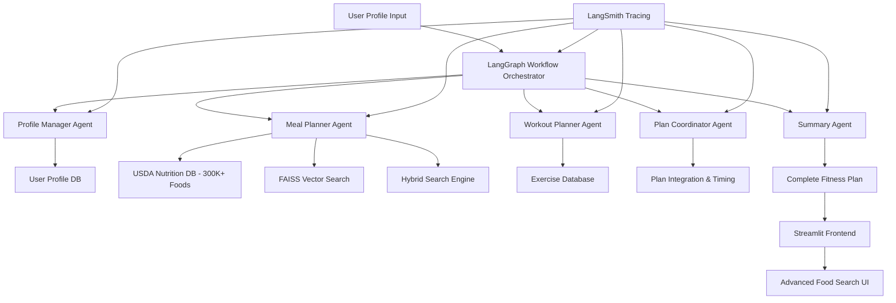

# AI Fitness Planner 🏋️‍♂️

A production-ready GenAI system that creates personalized fitness and nutrition plans using **LangGraph workflows**, real USDA nutrition data, and coordinated AI agents.

**What it does**: Upload your profile, get a complete meal + workout plan in minutes. It's like having a personal trainer and nutritionist, but powered by AI.

---

## 🚀 Quick Start (5 minutes)

**Prerequisites**: Docker and Git

```bash
# 1. Clone and setup
git clone https://github.com/zen-apps/ai-fitness-planner.git
cd ai-fitness-planner
cp .env.example .env

# 2. Download nutrition data (75MB)
curl -L -o usda_sampled_5000_foods.json https://github.com/zen-apps/ai-fitness-planner/releases/download/v1.0.0/usda_sampled_5000_foods.json
mkdir -p fast_api/app/api/nutrition_data/samples/
mv usda_sampled_5000_foods.json fast_api/app/api/nutrition_data/samples/

# 3. Start everything
make setup-demo
```

**That's it!** Access your app:
- **Frontend**: http://localhost:8526
- **API Docs**: http://localhost:1015/docs

---

## 🎯 What You Get

### ✅ **Personalized Plans**
- Custom calorie and macro targets based on your goals
- AI-generated meal plans using real USDA food data
- Workout routines tailored to your equipment and experience

### ✅ **Smart Food Search**
- Semantic search: "high protein breakfast foods" 
- 5,000 curated foods covering all major categories
- Dietary restriction filtering (vegetarian, gluten-free, etc.)

### ✅ **LangGraph AI Workflows**
- Multiple AI agents working together
- Profile → Meal Planning → Workout Planning → Coordination
- Real-time plan generation with full traceability

---

## 🛠️ How It Works

### **Multi-Agent System**



### **Tech Stack**
- **LangGraph**: AI workflow orchestration
- **GPT-4o-mini** and **GPT-o3-mini**: Fast, cost-effective reasoning
- **LangSmith**: Observability and tracing for AI workflows
- **FAISS**: Vector search for nutrition data
- **MongoDB**: 5K curated USDA foods
- **Streamlit**: Interactive frontend
- **FastAPI**: Production API backend

---

## 💡 Key Features

### **Smart Nutrition Database**
- 5,000 intelligently sampled foods from 450K+ USDA database
- Enhanced with per-100g nutrition calculations
- Macro breakdown analysis (high-protein/fat/carb classification)
- Sub-second semantic search

### **Coordinated Planning**
- Meal timing optimized around workouts
- Pre/post-workout nutrition recommendations
- Training day vs rest day meal variations
- Goal-specific plans (bulk/cut/maintenance)

### **Production Ready**
- Docker containerization
- Automated database setup
- LangSmith observability integration
- Comprehensive error handling

---

## 🔧 Development

```bash
# View logs
make logs

# Reset database
make clean-db

# Test the system
curl http://localhost:1015/docs
```

### **Environment Setup**
Edit `.env` with your API keys:
```bash
OPENAI_API_KEY=sk-your_openai_api_key_here
LANGSMITH_API_KEY=your_langsmith_key  # Optional
```

---

## 📊 Example Usage

**Input**: 25-year-old male, 180cm, 75kg, goal: lean bulk, gym access

**Output**:
```markdown
# Your Lean Bulk Plan

## Daily Targets
- 2800 calories
- 140g protein, 350g carbs, 93g fat

## Sample Meal
**Breakfast**: Protein Oats Bowl (520 cal)
- 80g oats, 30g whey protein, 150g banana

## Workout: Push Day
1. Bench Press: 4 sets × 6-8 reps
2. Overhead Press: 3 sets × 8-10 reps
```

---

## 🎨 What Makes This Special

### **LangGraph Workflows**
Unlike single LLM calls, this uses orchestrated AI agents that:
- Share context and coordinate decisions
- Handle complex multi-step reasoning
- Provide transparent execution tracking
- Scale to more complex scenarios

### **Real Data Integration**
- Actual USDA nutrition database (not fake data)
- Vector embeddings for semantic food matching
- Production-grade data processing pipeline

### **Production Patterns**
- Proper error handling and retry logic
- Observable with LangSmith tracing
- Scalable architecture with Docker
- Professional UI/UX

---

## 🚀 Next Steps

Want to extend this? Easy additions:
- **Progress Tracking Agent**: Monitor user improvements
- **Supplement Advisor**: Recommend supplements based on diet gaps
- **Wearable Integration**: Connect fitness trackers
- **Mobile App**: React Native frontend

---

## 📈 Why LangGraph?

Traditional LLMs give you one response. LangGraph gives you:
- **Coordinated Intelligence**: Multiple specialists working together
- **State Management**: Agents share and build on each other's work
- **Reliability**: Built-in error handling and retry mechanisms
- **Transparency**: See exactly how decisions are made

Perfect for complex, multi-step AI applications like fitness planning.

---

**Ready to build your own AI fitness coach?** Clone, run `make setup-demo`, and start generating personalized plans in minutes! 💪